# Rendu TP9 - captures d'écran

[Dépôt Github](https://github.com/NicolasCalvet/Gamagora_Moteur_Jeu)

## Partie 1

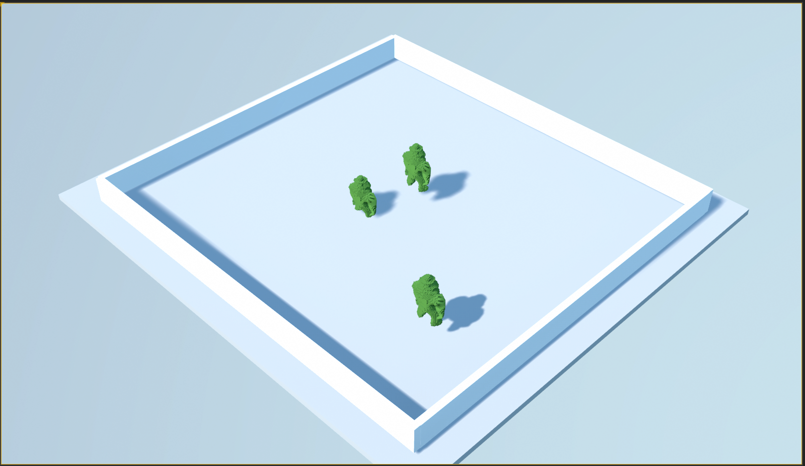

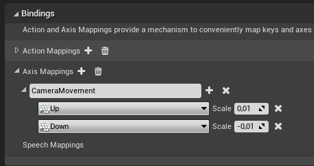

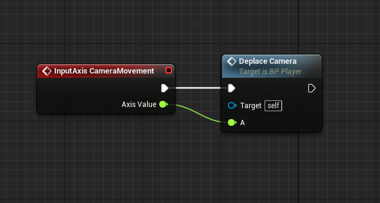

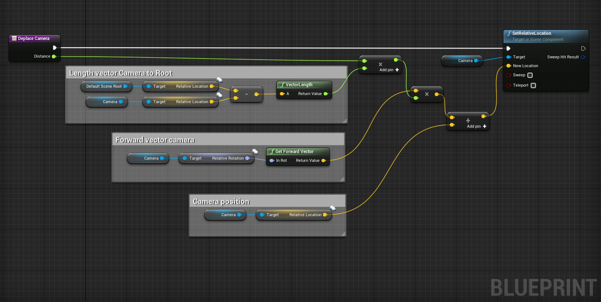

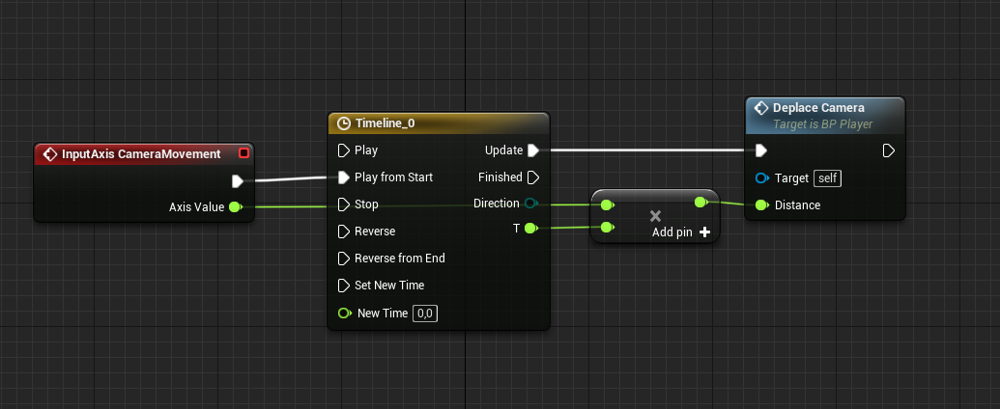

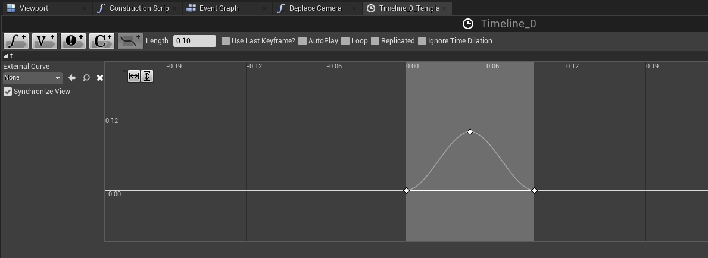

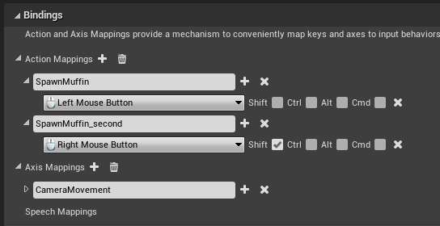

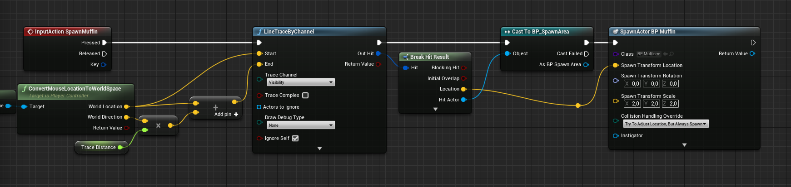

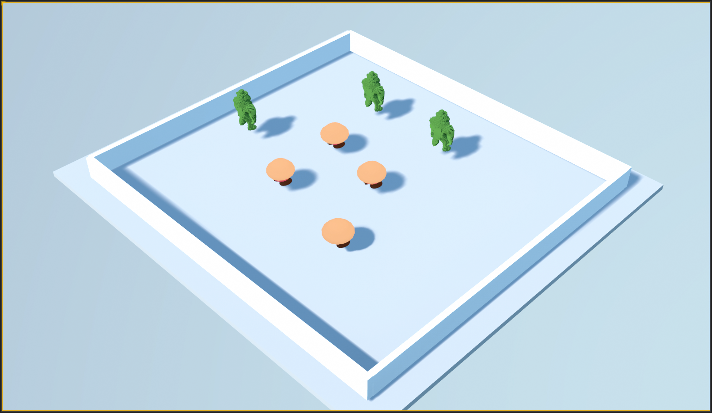

## Partie 2

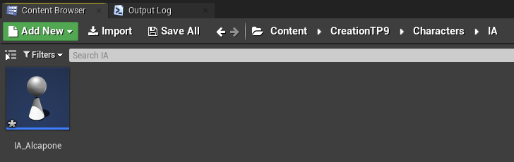

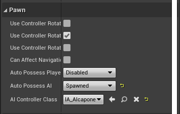

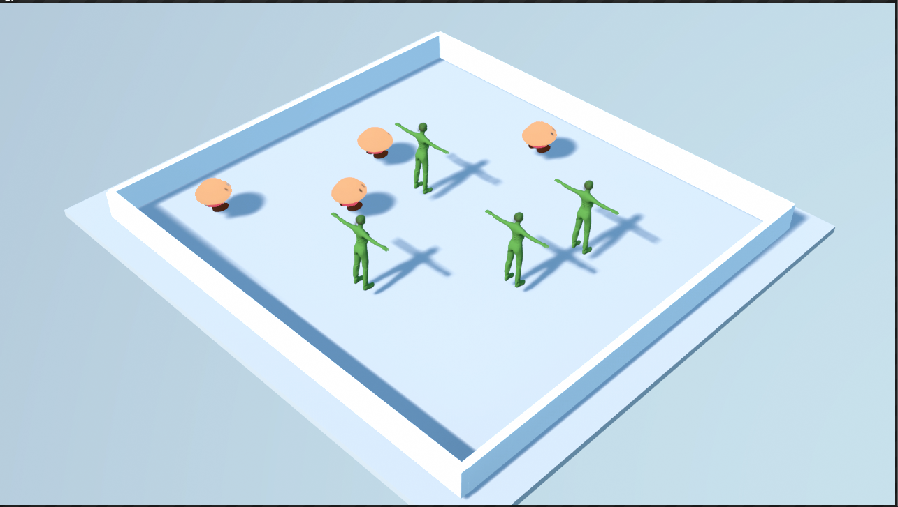

## Partie 3

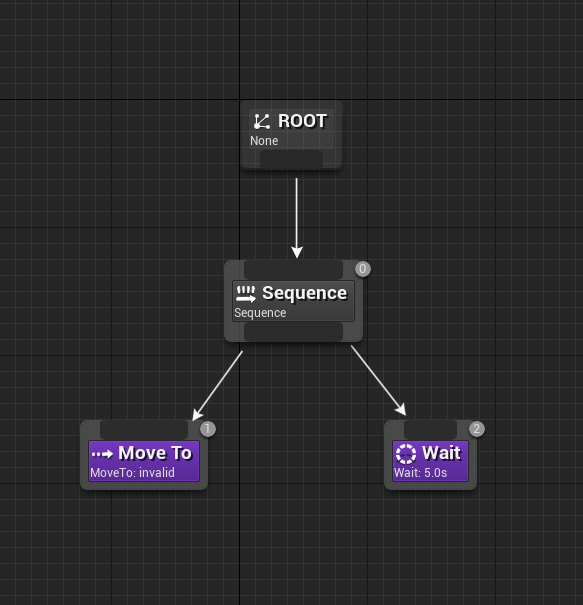

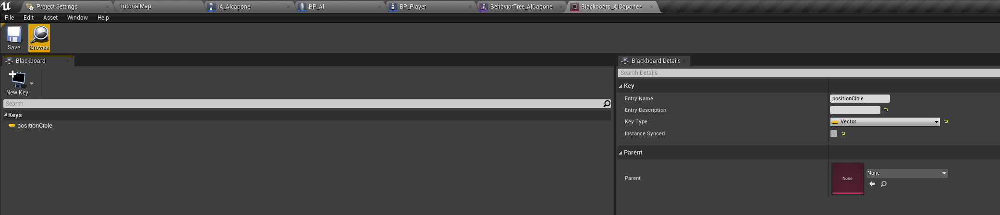

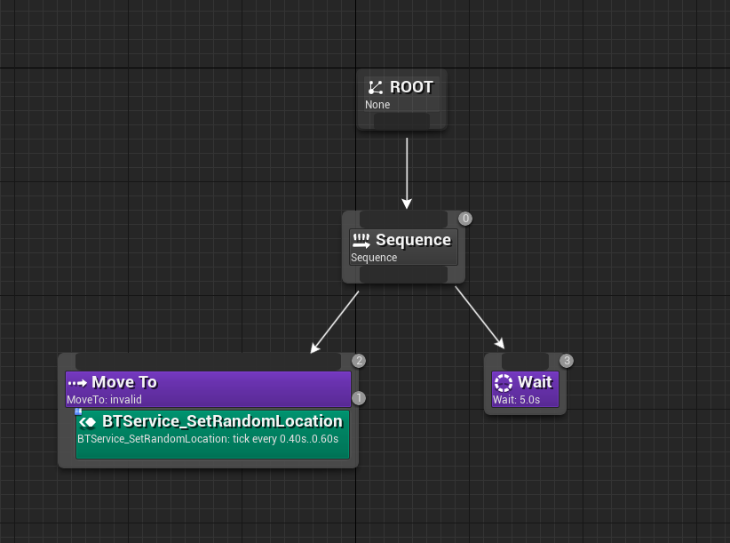

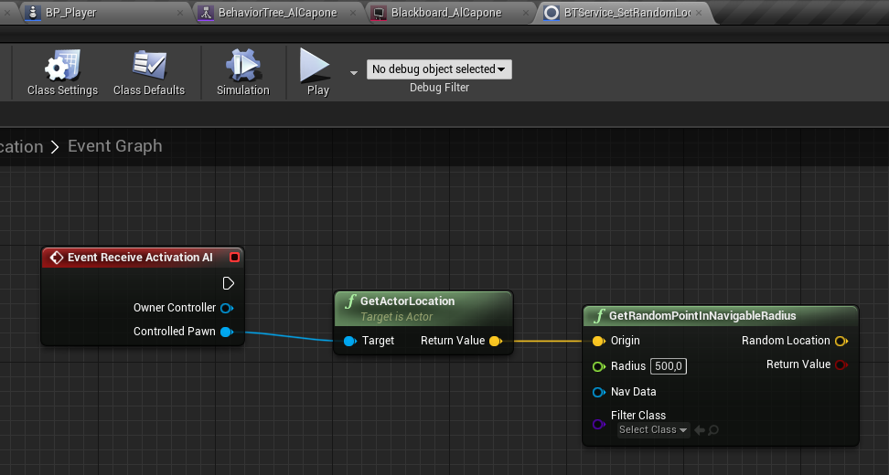

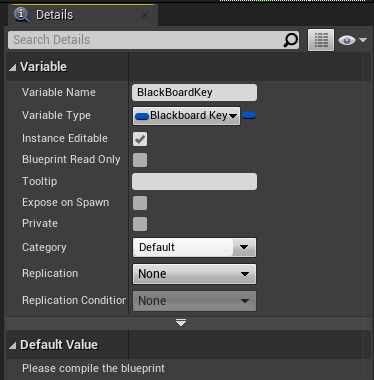

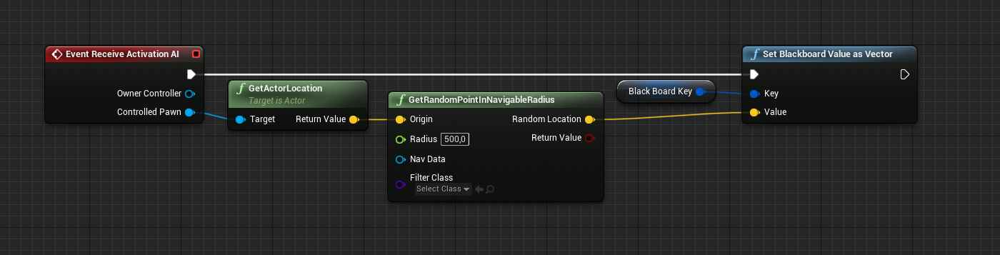

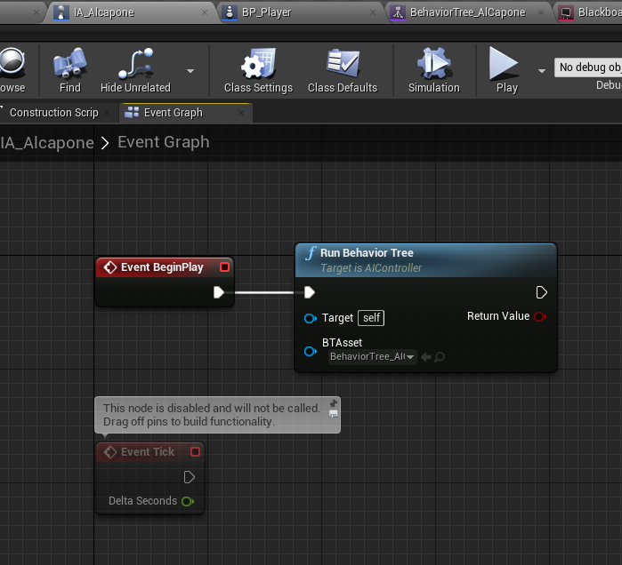

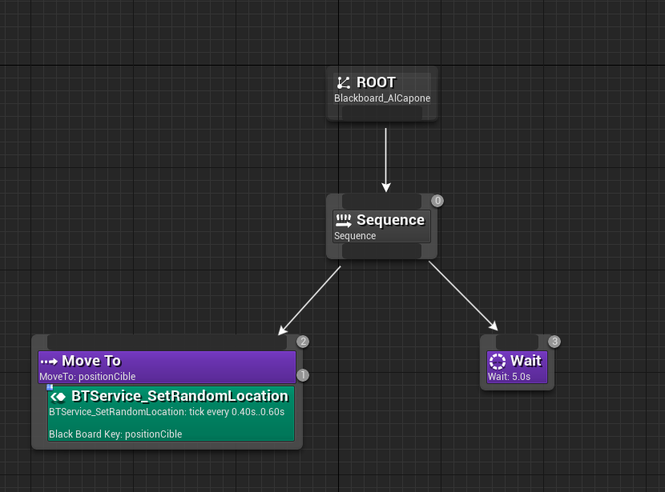

## Partie 4

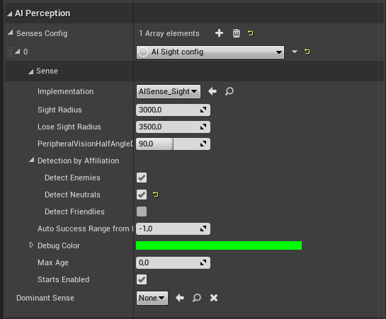

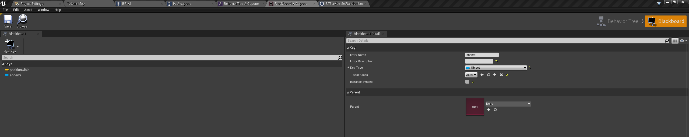

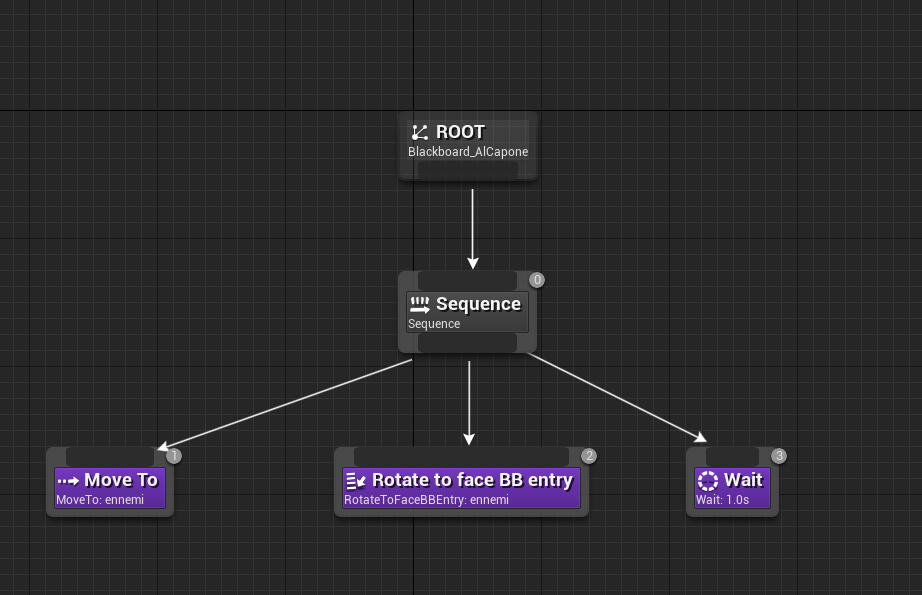

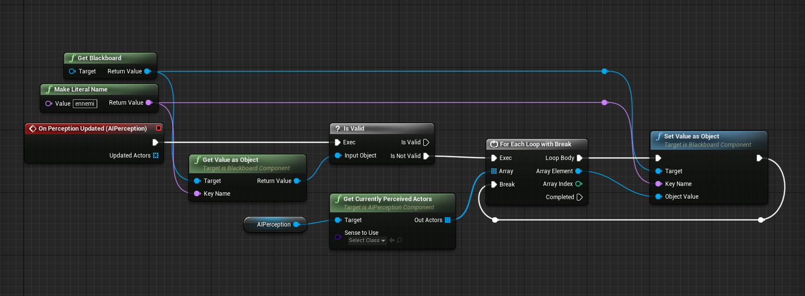

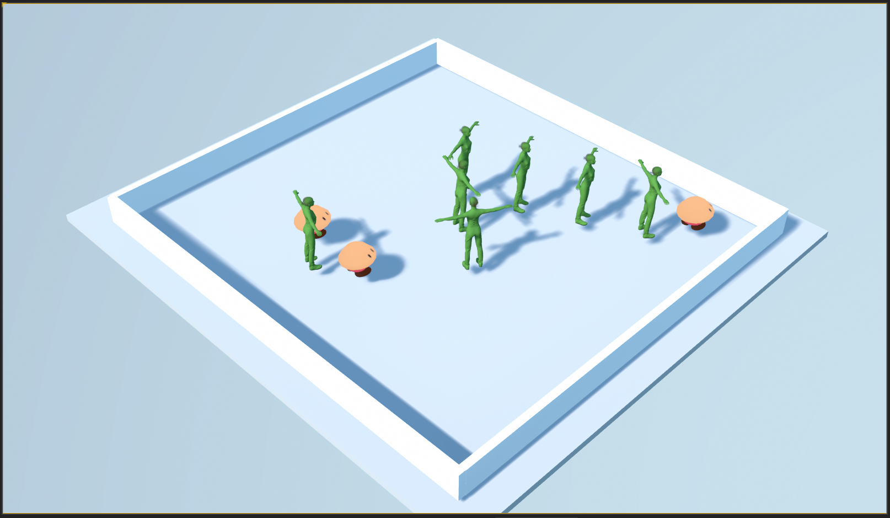

## Partie 5

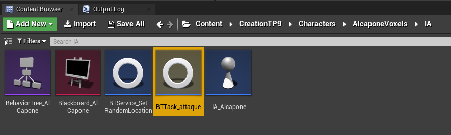

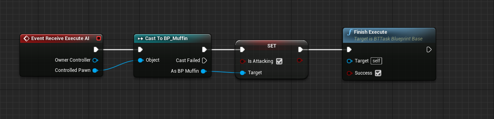

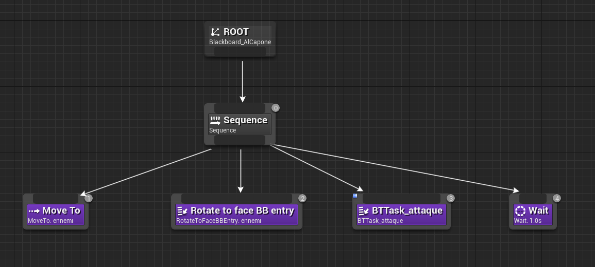

